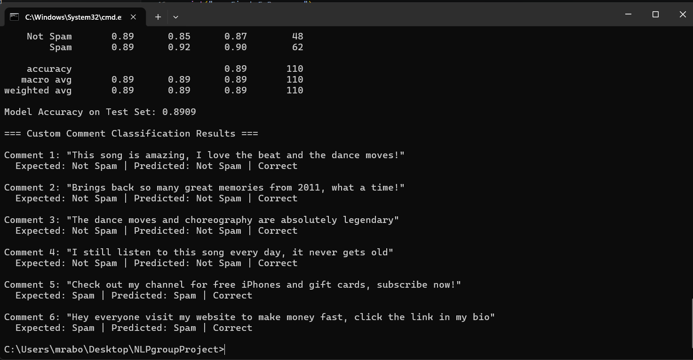

# YouTube Spam Comment Classifier

## NLP Group Project — Group 3

A Naive Bayes classifier that detects spam comments on YouTube videos using the Bag-of-Words model with TF-IDF weighting.

---

## Dataset

- **Source**: [UCI Machine Learning Repository — YouTube Spam Collection](https://archive.ics.uci.edu/dataset/380/youtube+spam+collection)
- **File**: `Youtube03-LMFAO.csv` (LMFAO - Party Rock Anthem)
- **Size**: 438 comments (202 non-spam, 236 spam)
- **Columns used**: `CONTENT` (comment text) and `CLASS` (0 = not spam, 1 = spam)

---

## How to Run

### 1. Install dependencies
```bash
pip install pandas numpy scikit-learn nltk
```

### 2. Run the classifier
```bash
python spam_classifier.py
```

---

## Project Pipeline

| Step | Description |
|------|-------------|
| 1. Load & Explore | Load CSV, check shape, class distribution, missing values |
| 2. Pre-process | Bag-of-Words with `CountVectorizer`, then TF-IDF downscaling |
| 3. Shuffle & Split | `pandas.sample(frac=1)` shuffle, 75/25 train-test split |
| 4. Train | `MultinomialNB` classifier + 5-fold cross-validation |
| 5. Test | Confusion matrix, classification report, accuracy |
| 6. Custom Comments | 6 new comments (4 legit, 2 spam) tested on the model |

---

## Results

| Metric | Value |
|--------|-------|
| Vocabulary Size | 856 unique words |
| 5-Fold CV Accuracy | 86.27% |
| Test Set Accuracy | **89.09%** |
| Custom Comments | 6/6 correct |

### Confusion Matrix
```
              Predicted
              Not Spam   Spam
Actual Not Spam   41        7
Actual Spam        5       57
```

### Output Screenshot


---

## Libraries Used

- **pandas** — Data loading and manipulation
- **numpy** — Numerical operations
- **scikit-learn** — CountVectorizer, TfidfTransformer, MultinomialNB, cross-validation, metrics
- **nltk** — English stopwords

---

## Team Members

- Group 3

---
